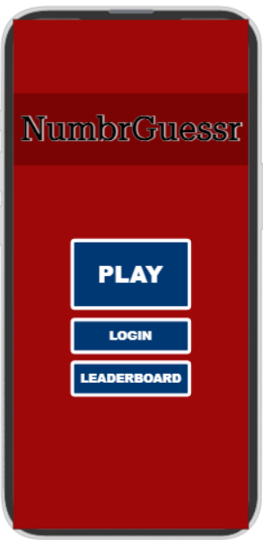
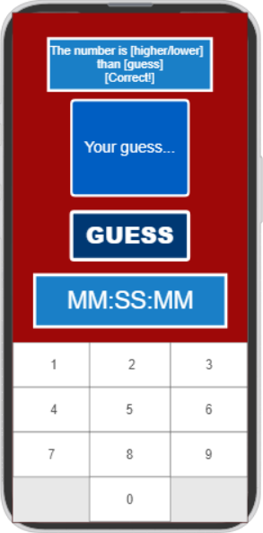
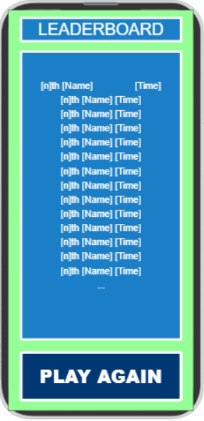
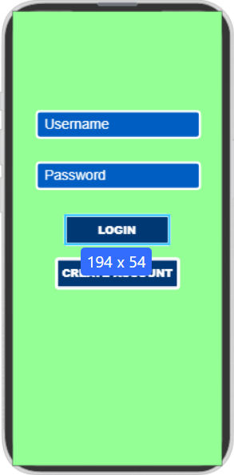

# NumbrGuessr

This application selects a random number from 1 to 1000 and responds to user's guesses by telling them that the number is higher or lower. It times the user and posts the fastest times on a leaderboard.

## 🚀 Specification Deliverable

For this deliverable I did the following. I checked the box `[x]` and added a description for things I completed.

- [x] Proper use of Markdown
- [x] A concise and compelling elevator pitch
- [x] Description of key features
- [x] Description of how you will use each technology
- [x] One or more rough sketches of your application. Images must be embedded in this file using Markdown image references.

### Elevator pitch

Do you like search algortihms? How about blind luck? NumbrGuessr combines those two concepts in a number-guessing game. Guess a number between 1-1000 in the shortest time possible! Every wrong guess will be rewarded with a hint to get you closer to the real number. Do you have the determination to guess over and over again in hopes of shaving miliseconds off of your score? Will you simply be satisfied with guessing a meaningless number, or will you attempt to dominate the leaderboard? Play NumberGuessr today!

### Design

 n 

The application will consist of four pages. The home page, the guess page, the leaderboard page, and the login page. Buttons will direct the user to the appropriate page. Text boxes that take input are all one color, text boxes that don't take input are all another color, and buttons are yet another color. The layout and pallet remain consistent throughout the design (although I definately will be changing the colors later on, I just needed something quick to start with). Also I might add the number of guesses it took to the leaderboard.

### Key features

- Secure login
- Leaderboard displaying the fastest times
- Number pad comes up when you tap the number guessing text box
- Text dynamically appears depending on user input
- Generates a random number each time

### Technologies

I am going to use the required technologies in the following ways.

- **HTML** - Layout + structure of the application. Not sure if I want to do an SPA or not yet, but I probably will. Diffrent page for home/guess/leaderboard/login
- **CSS** - Alignment and consistency throughout the app. Style fonts and colors so it looks at least a little nice. If I do a SPA then it will also be used to hide unwanted pages. Adapt to different screen sizes, optimized for mobile. More padding than what the designer thing let me do.
- **React** - Provides login, provides logic for switching pages, logic for guessing numbers, updates text, calls the backend endpoints.
- **Service** - Backend service with endpoints for:
    - login
    - submitting leaderboard scores
    - retrieving leaderboard scores
    - Register users, store credentials
- **DB/Login** - Store user authentication information and leaderboard information. Can't be on the leaderboard unless you're logged in.
- **WebSocket** - Live updates to the leaderboard as players achieve better times.

## 🚀 AWS deliverable

For this deliverable I did the following. I checked the box `[x]` and added a description for things I completed.

- [ ] **Server deployed and accessible with custom domain name** - [My server link](https://yourdomainnamehere.click).

## 🚀 HTML deliverable

For this deliverable I did the following. I checked the box `[x]` and added a description for things I completed.

- [ ] **HTML pages** - I did not complete this part of the deliverable.
- [ ] **Proper HTML element usage** - I did not complete this part of the deliverable.
- [ ] **Links** - I did not complete this part of the deliverable.
- [ ] **Text** - I did not complete this part of the deliverable.
- [ ] **3rd party API placeholder** - I did not complete this part of the deliverable.
- [ ] **Images** - I did not complete this part of the deliverable.
- [ ] **Login placeholder** - I did not complete this part of the deliverable.
- [ ] **DB data placeholder** - I did not complete this part of the deliverable.
- [ ] **WebSocket placeholder** - I did not complete this part of the deliverable.

## 🚀 CSS deliverable

For this deliverable I did the following. I checked the box `[x]` and added a description for things I completed.

- [ ] **Visually appealing colors and layout. No overflowing elements.** - I did not complete this part of the deliverable.
- [ ] **Use of a CSS framework** - I did not complete this part of the deliverable.
- [ ] **All visual elements styled using CSS** - I did not complete this part of the deliverable.
- [ ] **Responsive to window resizing using flexbox and/or grid display** - I did not complete this part of the deliverable.
- [ ] **Use of a imported font** - I did not complete this part of the deliverable.
- [ ] **Use of different types of selectors including element, class, ID, and pseudo selectors** - I did not complete this part of the deliverable.

## 🚀 React part 1: Routing deliverable

For this deliverable I did the following. I checked the box `[x]` and added a description for things I completed.

- [ ] **Bundled using Vite** - I did not complete this part of the deliverable.
- [ ] **Components** - I did not complete this part of the deliverable.
- [ ] **Router** - I did not complete this part of the deliverable.

## 🚀 React part 2: Reactivity deliverable

For this deliverable I did the following. I checked the box `[x]` and added a description for things I completed.

- [ ] **All functionality implemented or mocked out** - I did not complete this part of the deliverable.
- [ ] **Hooks** - I did not complete this part of the deliverable.

## 🚀 Service deliverable

For this deliverable I did the following. I checked the box `[x]` and added a description for things I completed.

- [ ] **Node.js/Express HTTP service** - I did not complete this part of the deliverable.
- [ ] **Static middleware for frontend** - I did not complete this part of the deliverable.
- [ ] **Calls to third party endpoints** - I did not complete this part of the deliverable.
- [ ] **Backend service endpoints** - I did not complete this part of the deliverable.
- [ ] **Frontend calls service endpoints** - I did not complete this part of the deliverable.
- [ ] **Supports registration, login, logout, and restricted endpoint** - I did not complete this part of the deliverable.

## 🚀 DB deliverable

For this deliverable I did the following. I checked the box `[x]` and added a description for things I completed.

- [ ] **Stores data in MongoDB** - I did not complete this part of the deliverable.
- [ ] **Stores credentials in MongoDB** - I did not complete this part of the deliverable.

## 🚀 WebSocket deliverable

For this deliverable I did the following. I checked the box `[x]` and added a description for things I completed.

- [ ] **Backend listens for WebSocket connection** - I did not complete this part of the deliverable.
- [ ] **Frontend makes WebSocket connection** - I did not complete this part of the deliverable.
- [ ] **Data sent over WebSocket connection** - I did not complete this part of the deliverable.
- [ ] **WebSocket data displayed** - I did not complete this part of the deliverable.
- [ ] **Application is fully functional** - I did not complete this part of the deliverable.
